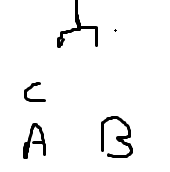
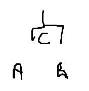
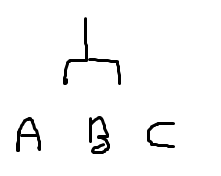
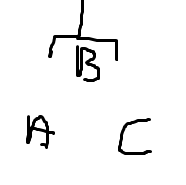
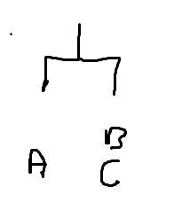
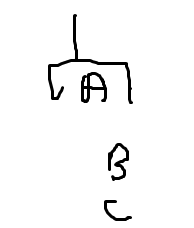
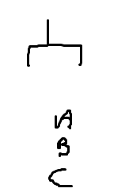
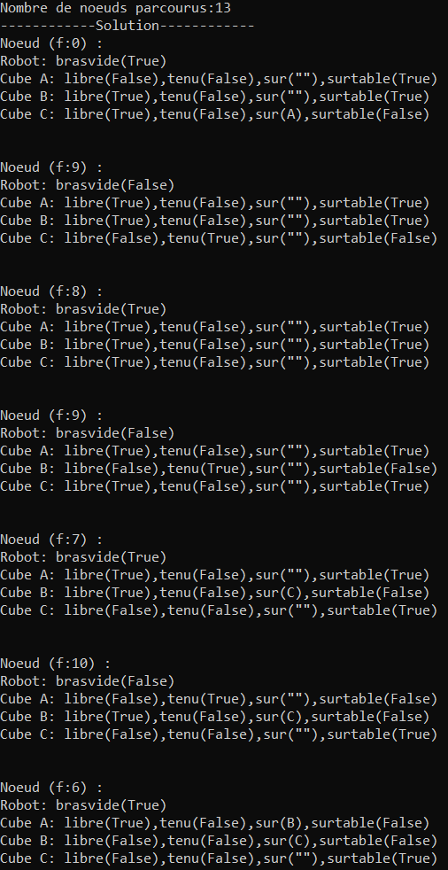
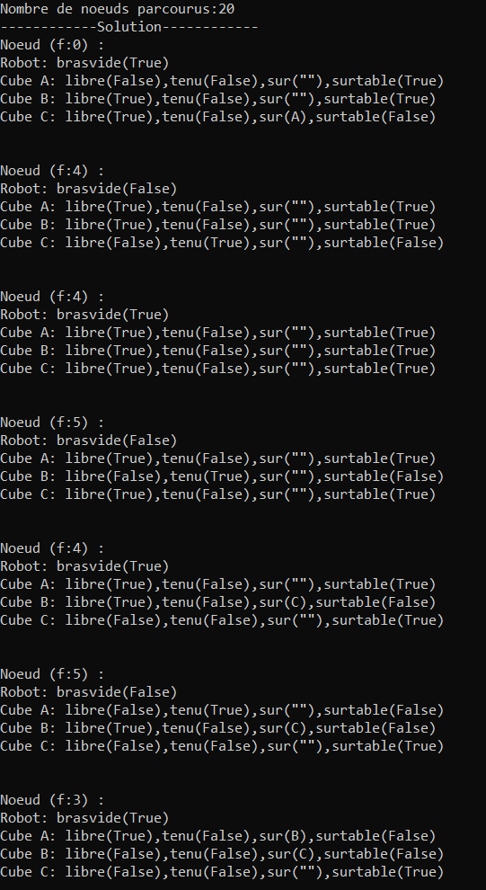

# Blocks World solved with A*

A planner for the classic **blocks-world** problem: three blocks, a table and a
robot arm. The state space is explored with **A\***, using two different cost
functions and two different heuristic functions so their effect on the size of
the search can be compared.

This is a university lab (L3 Computer Science, *Introduction to AI*), rewritten
as a small, documented Python package.

## The problem

Three blocks `A`, `B` and `C` rest on a table of unlimited size, and a robot arm
can pick one block up at a time. The arm must move the blocks from an initial
configuration to a goal configuration:

```
      initial state              goal state

        C                            A
        A       B                    B
                                     C
     ===============            ===============
          table                      table
```

<p align="center">
  <br>
  <em>The initial state, as sketched for the lab presentation.</em>
</p>

A state of the world is described by five predicates. Each one maps onto an
attribute of the model:

| Predicate     | Attribute   | Meaning                                                 |
| ------------- | ----------- | ------------------------------------------------------- |
| `LIBRE(X)`    | `free`      | nothing is stacked on `X` and the arm is not holding it |
| `TENU(X)`     | `held`      | `X` is currently in the gripper                         |
| `SUR(X, Y)`   | `on`        | `X` rests on block `Y`                                  |
| `SURTABLE(X)` | `on_table`  | `X` rests directly on the table                         |
| `BRASVIDE`    | `arm_empty` | the gripper holds no block                              |

Four production rules drive the arm. They are implemented in
[`blocksworld/robot.py`](blocksworld/robot.py):

| Rule | Action       | Precondition                                                  |
| ---- | ------------ | ------------------------------------------------------------- |
| R1   | `TENIR(X)`   | the arm is empty, `X` is free and on the table                |
| R2   | `TENIR(X)`   | the arm is empty, `X` is free and rests on another block      |
| R3   | `POSER(X)`   | the arm holds `X`, which is put back on the table             |
| R4   | `POSER(X,Y)` | the arm holds `X` and `Y` is free, so `X` is stacked onto `Y` |

## Modelling

A **node** of the search tree is a complete state: the three blocks plus the
arm. Expanding a node means applying the **twelve operators** that the three
blocks allow — for each block, pick it up, stack it on either of the other two,
or put it on the table — and keeping the ones whose preconditions hold.

Each operator is applied to its own copy of the node, so an operator that fails
cannot leave a half-modified state behind. Copying a state is the delicate part:
duplicating a block also duplicates the stack underneath it, so the `on`
references are relinked afterwards onto the three blocks of the new node
(`Node.copy_from`). Skipping that step would let two copies of the same block
coexist and would break every state comparison.

Two nodes are equal when their three blocks and their arm are equal, ignoring
the A* bookkeeping — equality means "the same state of the world", which is what
the OPEN and CLOSED lookups need.

## Cost and heuristic functions

Two pairs of functions are available, and any combination of them can be
selected from the command line.

**`g1` — uniform cost.** Every operator costs 1, so `g` is the number of
operators applied since the initial state.

**`g2` — cost per block placed.** Only `POSER` costs 1; `TENIR` is free. A
complete move (pick a block up, then put it down) still costs 1, so `g2` counts
placements rather than arm actions.

**`h1` — predicates that differ.** Every block attribute is compared with its
counterpart in the goal state, and `BRASVIDE` is compared as well. Each
difference adds 1, so `h1` ranges from 0 to 13.

**`h2` — blocks that differ.** A block counts for 1 as soon as any of its
predicates differs, instead of counting each predicate separately. The arm is
compared the same way, so `h2` ranges from 0 to 4.

## Repository structure

```
.
|-- main.py                   command-line entry point
|-- requirements.txt          dependencies (the standard library only)
|-- blocksworld/
|   |-- __init__.py
|   |-- cube.py               the blocks and their predicates
|   |-- robot.py              the arm and the four production rules R1-R4
|   |-- node.py               a search state, the cost and heuristic functions
|   |-- operators.py          the twelve operators generating the children
|   |-- astar.py              the A* search itself
|   `-- scenarios.py          the initial and goal states to run on
`-- docs/images/              the figures used in this README
```

## Data

There is no dataset: a run is fully described by its initial and goal states,
which are defined in code in
[`blocksworld/scenarios.py`](blocksworld/scenarios.py). Two scenarios ship with
the project:

- **`subject`** (default) — the states of the figure above, `C` on `A` and `B`
  on the table, to `A` on `B` on `C`.
- **`flat`** — a shorter run, the three blocks starting on the table, to `A`
  stacked on `C`.

Adding a placement of the blocks means adding a function to that module and an
entry in its `SCENARIOS` dictionary.

The course handout and the presentation slides the lab was graded on are
deliberately **not** included in this repository. Only the figures reproduced in
this README were taken from the presentation: the hand-drawn sketches of the
seven states of the plan, and the two screenshots of the program output.

## Running

Python 3.7 or newer is enough and there is nothing to install — the project uses
the standard library only.

```bash
git clone https://github.com/NathanPLONTZ/blocks-world-astar.git
cd blocks-world-astar
python main.py
```

Options:

```bash
python main.py --cost g2 --heuristic h2      # the second pair of functions
python main.py --scenario flat               # the shorter scenario
python main.py --help
```

| Option        | Values            | Default   |
| ------------- | ----------------- | --------- |
| `--scenario`  | `subject`, `flat` | `subject` |
| `--cost`      | `g1`, `g2`        | `g1`      |
| `--heuristic` | `h1`, `h2`        | `h1`      |

The program prints the number of nodes taken out of OPEN, then every state along
the solution, from the initial state to the goal:

```
Nombre de noeuds parcourus:13
------------Solution------------
Noeud (f:0) :
Robot: brasvide(True)
Cube A: libre(False),tenu(False),sur(""),surtable(True)
Cube B: libre(True),tenu(False),sur(""),surtable(True)
Cube C: libre(True),tenu(False),sur(A),surtable(False)
...
```

## Results

On the scenario of the subject, every combination of functions finds the **same
optimal plan of 6 operators**, but the size of the search varies by a factor of
almost three:

| Cost | Heuristic | Nodes visited | Operators in the plan |
| ---- | --------- | ------------- | --------------------- |
| `g1` | `h1`      | **13**        | 6                     |
| `g2` | `h2`      | **20**        | 6                     |
| `g1` | `h2`      | 23            | 6                     |
| `g2` | `h1`      | 8             | 6                     |

The first two rows are the two runs that were presented for the lab; the other
two combinations are reported for completeness.

The plan found is the expected one — unstack `C`, then build the tower
bottom-up:

1. `TENIR(C)` — pick `C` up, which frees `A` (rule R2)
2. `POSER(C)` — put `C` on the table (R3)
3. `TENIR(B)` — pick `B` up (R1)
4. `POSER(B, C)` — stack `B` onto `C` (R4)
5. `TENIR(A)` — pick `A` up (R1)
6. `POSER(A, B)` — stack `A` onto `B` (R4)

The seven states it goes through, as they were sketched for the lab
presentation:

|                            1. initial                            |                          2. `TENIR(C)`                           |                          3. `POSER(C)`                           |                          4. `TENIR(B)`                           |
| :--------------------------------------------------------------: | :--------------------------------------------------------------: | :--------------------------------------------------------------: | :--------------------------------------------------------------: |
|  |  |  |  |

|                         5. `POSER(B, C)`                         |                          6. `TENIR(A)`                           |                         7. `POSER(A, B)`                         |
| :--------------------------------------------------------------: | :--------------------------------------------------------------: | :--------------------------------------------------------------: |
|  |  |  |

Six operators is optimal here: `C` has to be moved off `A` before anything can
be stacked, and each of the three blocks has to be picked up and put down once.

### Program output

The two runs as they were presented. Each one prints the number of nodes taken
out of OPEN, then every state along the solution:

| `g1` / `h1` — 13 nodes | `g2` / `h2` — 20 nodes |
| :--------------------: | :--------------------: |
|  |  |

Both runs end on the same state, the goal:

<p align="center">
  <br>
  <em>The goal state, reached in six operators.</em>
</p>

### Conclusions

**The heuristic matters far more than the cost function.** Switching from `h1`
to `h2` at equal cost function raises the search from 13 to 23 nodes. `h1`
counts thirteen predicates and changes value after almost every operator, so it
separates promising states from poor ones. `h2` only counts how many of the four
objects are misplaced: it is nearly flat — it never exceeds 4 and barely moves
as the search progresses — so A* has little to go on and explores much wider. A
finer-grained heuristic is the better guide.

**`g2` shrinks the search, but for a misleading reason.** It is the cheapest
configuration (8 nodes with `h1`), because charging nothing for `TENIR` makes
`f` grow more slowly and keeps half of the generated states at the same `f` as
their parent. That reduces the number of nodes examined, but it also means `g2`
no longer measures the number of arm actions, so the `f` values of two states
are less comparable than with `g1`.

**A note on admissibility.** `h1` can overestimate the remaining cost: at the
initial state it returns 9 while the optimal plan is 6 operators. A single
operator changes several predicates at once, so counting predicates one by one
overshoots. A* with `h1` is therefore not guaranteed to return an optimal plan
in general, even though it does on this instance. `h2` stays below the real cost
here, but is too coarse to be useful as a guide. Neither function is an
admissible heuristic in the strict sense of a lower bound that stays tight.

## A note on the search implementation

In `astar`, the CLOSED-list test runs **before** `g`, `h` and `f` are computed
for a child. This is the order of the version the lab was presented with, and
the reason the node counts above are reproducible.

The consequence is documented in
[`blocksworld/astar.py`](blocksworld/astar.py): at that point `child.g` still
holds its initial value of `0`, so the test only discards a child matching a
CLOSED node of cost `0` and re-opens the others, which makes the search expand
some states more than once. Moving the three assignments above that loop gives
the textbook A*, the same solution plans, and smaller searches — 12 nodes
instead of 13 with `g1`/`h1`, and 18 instead of 20 with `g2`/`h2`.
